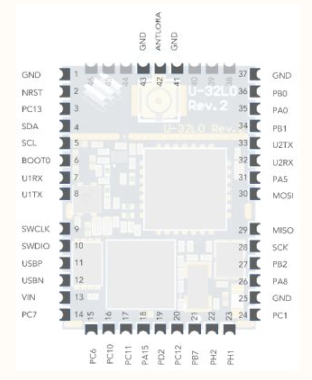
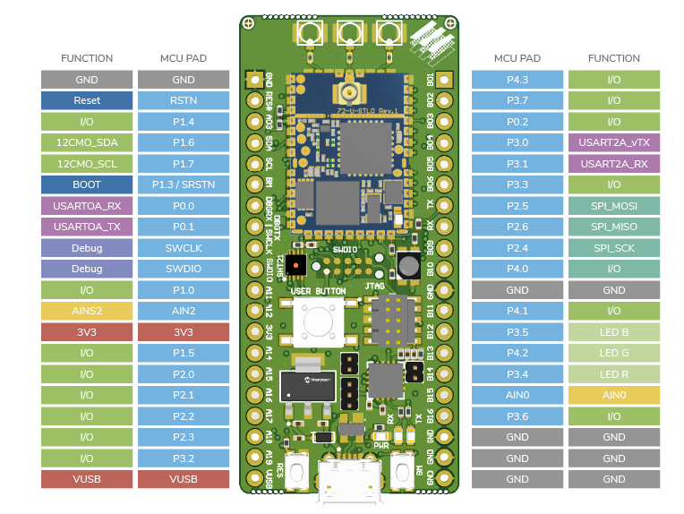

# FMLR_EVK_Manual_Stop_Mode_Example

This is an example using the Miromico DEV-FMLR-STWVK1 evaluation kit, and manually configuring:

* the MX25 4Mb flash to deep sleep (<1uA)
* the Semtech SX1272 radio IC to standby (<1uA)
* the STM32 I/Os to sink/source minimum current
* the STM32 to Stop mode

to achieve ~1uA FMLR module consumption, as required in the Zelp 1.0 DL project.

This demonstrator is to show it is possible, albeit on the much simpler EVK PCB.

Useful links:

[EVK Schematics](https://docs.miromico.ch/datasheets/_attachments/evk/dk_fmlr_stm_SX12xx_V5.0.pdf)  
[EVK Quick Start Guide](https://docs.miromico.ch/datasheets/_attachments/evk/dk_fmlr_stm_SX12xx_V5.0.pdf)  

  
  
